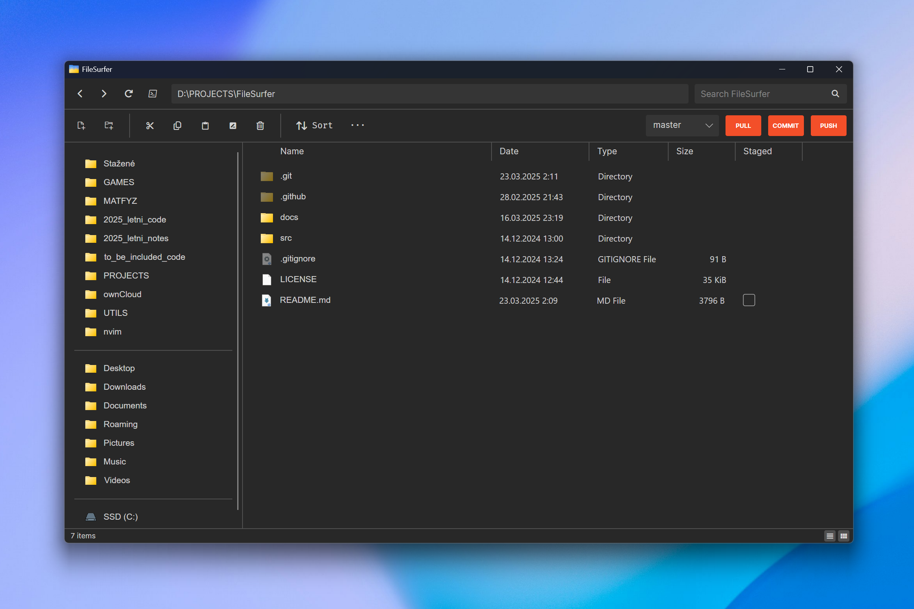
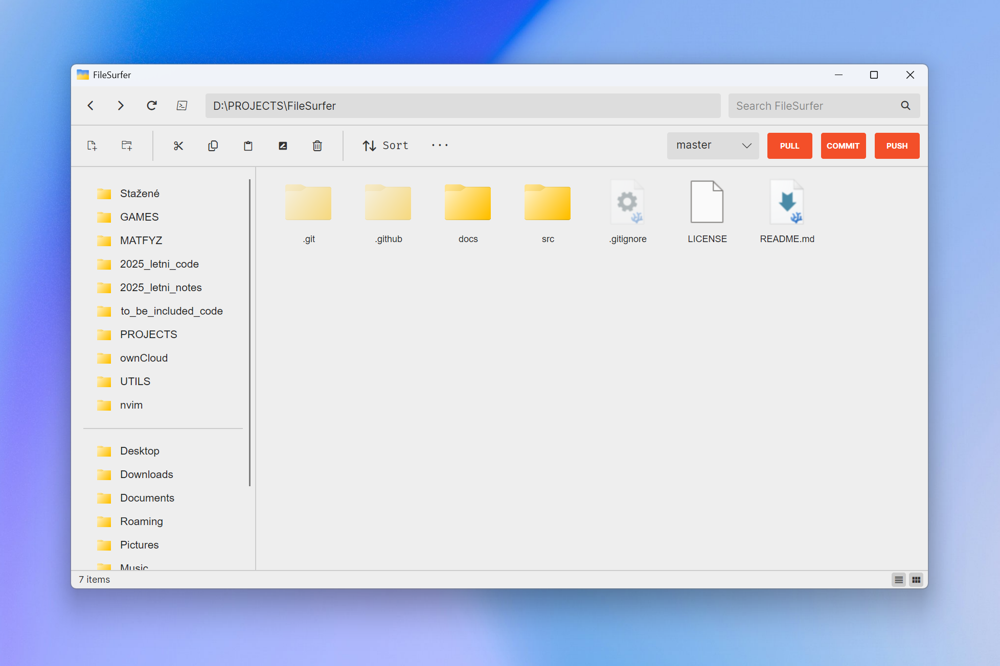

<p align="center">
  
</p>
<h1 align="center">FileSurfer</h1>
<h3 align="center">A Modern, Open-Source File Explorer for Windows</h3>

---

FileSurfer is an open-source Windows file explorer built with Avalonia UI.
FileSurfer is designed for convenience and efficiency, targeting more technical users while still providing a familiar and modern interface.
I've also included features that I personally find useful, even if they're not commonly found in other file explorers.
Your feedback is very welcome: if you encounter any bugs or have suggestions, please open an issue here on GitHub!

---

## ✨ **Features**  
All what you'd expect from a file manager plus some more:  

- 📋 **Image Pasting from Clipboard**: Paste images directly from your clipboard into folders.  
- 🕶️ **Dotfile Handling**: Treats dotfiles (e.g., `.gitignore`) as hidden files, just like on a Unix system.  
- 🔄 **Batch Renaming**: Rename multiple files or directories at once.  
- ⏪ **Undo & Redo**: Reverse most file operations with a simple undo/redo feature.  
- 📁 **Saving Last Opened Directory**: Pick up where you left off.
- 🐙 **Git Integration**: Speed up basic interactions with Git repositories directly from the app.  

---

## 🖼️ **Screenshots**  
  
*Dark interface using the list view in a Git repository.*

  
*Light interface using the icon view.*

---

## 🚀 **Getting Started**  

### **Download and Install**  
1. Download the latest release from the [Releases Page](https://github.com/JANECEA/FileSurfer/releases/latest).  
2. Just extract the `.zip`, open the executable file, and you're all set!

### **Build from Source**  
If you're a developer or want to customize FileSurfer, you can build it from source. Check out the 
[Building from Source](#️-building-from-source) section for detailed instructions.  

---

## 🛠️ **Building from Source**  

To build FileSurfer from source, you'll need the following:  

### **Prerequisites**  
- **.NET 8.0**  
- **Avalonia UI**  
- **Git for Windows** (optional, for Git integration)  

### **Steps**  
1. Install the [.NET Build Tools](https://visualstudio.microsoft.com/cs/visual-cpp-build-tools/).  
2. Open the *"Developer Command Prompt for VS 2022"* app on your computer.  
3. Run the following commands:  
   ```bash  
   dotnet restore "path\to\FileSurfer.csproj"  
   msbuild "path\to\FileSurfer.sln" /t:publish /p:Configuration=Release /p:DeployOnBuild=true  
   ```  
4. Locate the compiled executable at:  
   ```  
   .\src\FileSurfer\bin\Release\net8.0-windows\FileSurfer.exe  
   ```  

*(You can also use Visual Studio 2022 to build the project.)*  

---

## 📚 **Documentation**  

- **[User Guide](docs/UserGuide/UserGuide.md)**: Learn how to use FileSurfer's features.  
- **[Specification](docs/Specification/)**: Check out the [technical](docs/Specification/TechnicalSpecification.md) and [functional](docs/Specification/FunctionalSpecification.md) specification of the project.  
- **[Technical Documentation](docs/Documentation/Overview.md)**: Take a look at the technical details of the project.  

---

## 📦 **Dependencies**  

FileSurfer relies on the following dependencies:  

### **.NET and Frameworks**  
- .NET 8.0  
- Avalonia UI  
- Windows Forms (for clipboard integration)  

### **NuGet Packages**  
- Avalonia (v11.0.10)  
- Avalonia.Desktop (v11.0.10)  
- Avalonia.Themes.Fluent (v11.0.10)  
- Avalonia.Fonts.Inter (v11.0.10)  
- Avalonia.ReactiveUI (v11.0.10)  
- LibGit2Sharp (v0.30.0)  
- SharpCompress (v0.37.2)  

### **COM References**  
- Shell32 (GUID: `50a7e9b0-70ef-11d1-b75a-00a0c90564fe`)  
- IWshRuntimeLibrary (GUID: `f935dc20-1cf0-11d0-adb9-00c04fd58a0b`)  

Ensure these COM components are registered on your system.  
