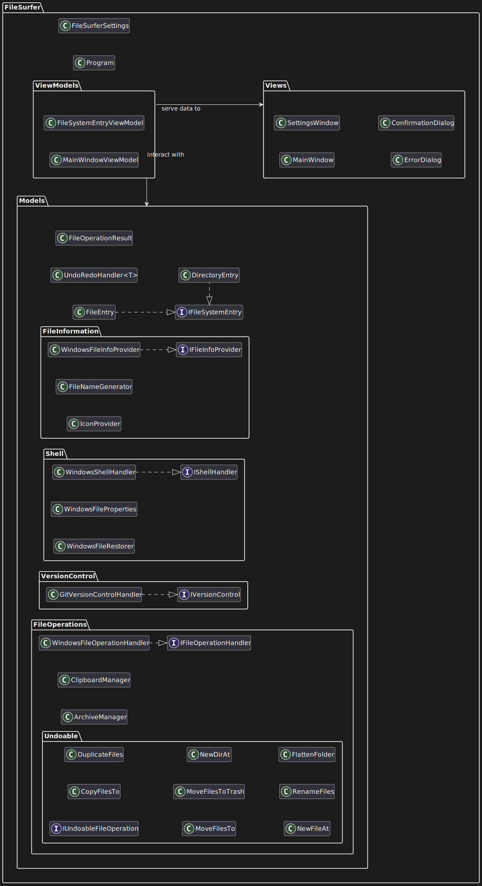

# Technical specification

## Overview
FileSurfer implements the Model-View-ViewModel (MVVM) architectural pattern.
The Models layer (FileSurfer.Models) encapsulates functional logic and file system operations. 
Views (FileSurfer.Views) represent the UI elements with minimal functional logic.
ViewModels (FileSurfer.ViewModels) serve as a layer in between the Views and the Models, 
transforming data for the UI and routing user input to the appropriate Model functions.

## Namespaces, Classes, and Interfaces

### FileSurfer
- **Program**: Entry point for the FileSurfer application.
- **FileSurferSettings**: Manages application configuration and user preferences.

### FileSurfer.Models 
- **IFileOperationHandler**: Interface defining methods for file system operations.
- **IFileInfoProvider**: Interface for retrieving file metadata and properties.
- **IVersionControl**: Interface for integration with version control systems.
- **IShellInteraction**: Interface for interacting with the operating system shell.
- **IFileSystemEntry**: Base interface for file system objects.
- **FileEntry**: Represents a file in the file system.
- **DirectoryEntry**: Represents a directory in the file system.
- **IconProvider**: Manages and retrieves icons for different file types.
- **ArchiveManager**: Handles compression and extraction of archive files.
- **ClipboardManager**: Manages clipboard operations for files and directories.
- **FileNameGenerator**: Creates unique filenames for new or copied files.
- **GitVersionControlHandler**: Implementation of version control operations for Git repositories.
- **UndoRedoHandler\<T\>**: Generic class managing undo and redo operations.
- **FileOperationResult**: Represents the outcome of a file operation.
- **WindowsFileOperationHandler**: Windows-specific implementation of file operations.
- **WindowsFileProperties**: Provides access to Windows-specific file attributes.
- **WindowsFileInfoProvider**: Windows-specific implementation for retrieving file information.
- **WindowsFileRestorer**: Handles restoration of deleted files on Windows.
- **WindowsShellHandler**: Windows-specific implementation for shell interactions.

### FileSurfer.Models.UndoableFileOperations 
- **IUndoableFileOperation**: Interface for operations that can be undone.
- **CopyFilesTo**: Undoable operation for copying files to a destination.
- **DuplicateFiles**: Undoable operation for creating duplicates of files.
- **MoveFilesTo**: Undoable operation for moving files to a new location.
- **MoveFilesToTrash**: Undoable operation for moving files to the recycle bin/trash.
- **NewDirAt**: Undoable operation for creating a new directory.
- **NewFileAt**: Undoable operation for creating a new file.
- **RenameFiles**: Undoable operation for renaming files.
- **FlattenFolder**: Undoable operation for moving all files from subfolders to a parent folder.

### FileSurfer.ViewModels 
- **MainWindowViewModel**: Primary view model that coordinates the application's main functionality.
- **FileSystemEntryViewModel**: View model representing displayable file system entries.

### FileSurfer.Views 
- **MainWindow**: The main application window.
- **SettingsWindow**: Window for configuring application settings.
- **ErrorDialog**: Dialog for displaying error messages.
- **ConfirmationDialog**: Dialog for requesting user confirmation.