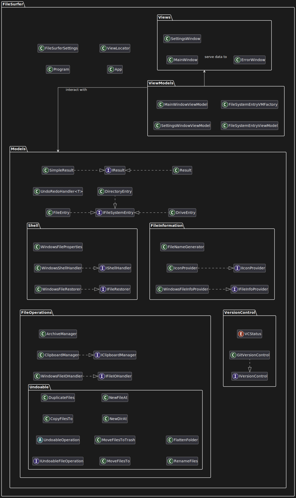

# Technical specification
**FileSurfer** implements the Model-View-ViewModel (MVVM) architectural pattern.
It is built with **C#**, using the **Reactive UI** framework within the **Avalonia UI** ecosystem.

The **Models** layer (FileSurfer.Models) encapsulates functional logic and file system operations. 

**Views** (FileSurfer.Views) represent the UI elements with minimal functional logic.

**ViewModels** (FileSurfer.ViewModels) serve as a layer in between the Views and the Models, 
transforming data for the UI and routing user input to the appropriate Model functions.

## Namespaces, Classes, and Interfaces

### FileSurfer
- **Program**: Entry point for the FileSurfer application.
- **FileSurferSettings**: Manages application configuration and user preferences.
- **App**: Entry point for the application. *(generated by AvaloniaUI)*
- **ViewLocator**: Instantiates views. *(generated by AvaloniaUI)*

### FileSurfer.Models 
- **IFileSystemEntry**: Base interface for file system objects.
- **FileEntry**: Implements `IFileSystemEntry`. Represents a file in the file system.
- **DirectoryEntry**: Implements `IFileSystemEntry`. Represents a directory in the file system.
- **DriveEntry**: Implements `IFileSystemEntry`. Represents a drive in the file system.
- **UndoRedoHandler\<T\>**: Generic class managing undo and redo operations.
- **IResult**: Interface representing the outcome of an operation in the *FileSurfer* app.
- **SimpleResult**: Lightweight implementation of `IResult`.
- **Result**: Flexible but more memory intensive implementation of `IResult`.

#### FileSurfer.Models.FileInformation
- **IFileInfoProvider**: Interface for retrieving file metadata and properties.
- **WindowsFileInfoProvider**: Windows-specific implementation of `IFileInfoProvider` for retrieving file information.
- **IIconProvider**: Interface for retrieving icons for different file types.
- **IconProvider**: Implements `IIConProvider`.
- **FileNameGenerator**: Creates unique filenames for new or copied files.

#### FileSurfer.Models.VersionControl
- **VCStatus**: Enum representing the different states of files within a git repository in the context of FileSurfer.
- **IVersionControl**: Interface for integration with version control systems.
- **GitVersionControl**: Implementation of `IVersionControl` operations for Git repositories.
    - Implemented using the `LibGit2Sharp` NuGet package.

#### FileSurfer.Models.Shell
- **IShellHandler**: Interface for interacting with the OS shell.
- **WindowsShellHandler**: Windows-specific implementation of `IShellHandler` for shell interactions.
    - Uses `System.Runtime.InteropServices` to interop with the Windows shell.
- **IFileRestorer**: Interface for restoration of deleted files and directories.
- **WindowsFileRestorer**: Implementation of `IFileRestorer` for restoration of deleted files on Windows.
    - Implemented using the `Shell32` COM reference.
- **WindowsFileProperties**: Provides access to the native Windows file properties window.

#### FileSurfer.Models.FileOperations
- **IFileIOHandler**: Interface defining methods for file system operations.
- **WindowsFileIOHandler**: Windows-specific implementation of file operations.
    - Most operations are implemented using `Microsoft.VisualBasic.FileIO` for providing native Windows confirmation dialogs
- **IClipboardManager**: Interface for managing clipboard operations for files and directories.
- **ClipboardManager**: Implements `IClipboardManager`.
    - Uses **Windows Forms** to interact with the system clipboard. (subject to change)
- **ArchiveManager**: Handles compression and extraction of archive files.
    - Implemented using the `SharpCompress` NuGet package.

##### FileSurfer.Models.FileOperations.Undoable
- **IUndoableFileOperation**: Interface for operations that can be undone.
- **UndoableOperation**: Abstract class for operations on multiple entries.
- **CopyFilesTo**: Undoable operation for copying files to a destination.
- **DuplicateFiles**: Undoable operation for creating duplicates of files.
- **MoveFilesTo**: Undoable operation for moving files to a new location.
- **MoveFilesToTrash**: Undoable operation for moving files to the recycle bin/trash.
- **NewDirAt**: Undoable operation for creating a new directory.
- **NewFileAt**: Undoable operation for creating a new file.
- **RenameFiles**: Undoable operation for renaming files.
- **FlattenFolder**: Undoable operation for moving all files from a subfolder to a parent folder.

### FileSurfer.ViewModels 
- **SettingsWindowViewModel**: View model that coordinates the application's settings window.
- **MainWindowViewModel**: Primary view model that coordinates the application's main functionality.
- **FileSystemEntryViewModel**: View model representing displayable file system entries.
- **FileSystemEntryVMFactory**: Factory class for simplifying the creation of `FileSystemEntryViewModel`s.

### FileSurfer.Views 
- **MainWindow**: The main application window.
- **ErrorWindow**: Dialog for displaying error messages.
- **SettingsWindow**: Window for configuring application settings.