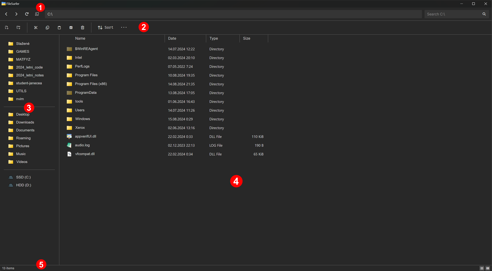
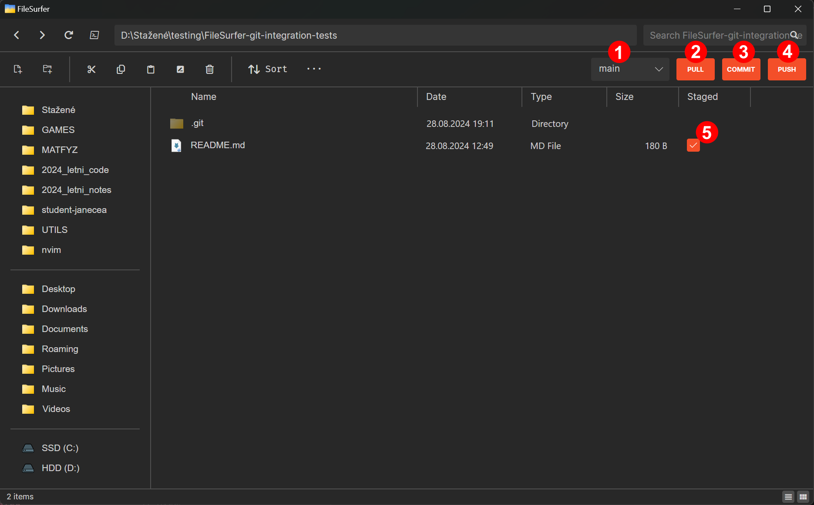

# FileSurfer User Guide


## Table of Contents
1. [Introduction](#introduction)
2. [Installation](#installation)
3. [Getting Started](#getting-started)
   - [User Interface Overview](#user-interface-overview)
4. [Basic Features](#basic-features)
   - [Navigating Folders](#navigating-folders)
   - [File Operations](#file-operations)
5. [Advanced features](#advanced-features)
   - [Git Integration](#git-integration)
6. [Settings and Preferences](#settings-and-preferences)
7. [Keyboard shortcuts](#keyboard-shortcuts)
---


## Introduction
Welcome to the **FileSurfer** User Guide. This guide will help you use the features of FileSurfer efficiently.


## Installation
Refer to [README.md](../README.md) for instructions on how to build the project from source.


## Getting Started
### User Interface Overview
When you open FileSurfer, you will see an interface that is divided into several key sections:

 
1. **First toolbar**:
   - **Back** and **Forward**: Navigate through your browsing history.
   - **Refresh**: Reload the current directory's contents.
   - **Powershell**: Open the current directory in powershell.
   - **Path Bar**: displays the path to the current directory. Is editable.
   - **Search Bar** (Top-Right): Allows you to quickly find files and directories within the current directory or the entire system. 

2. **Second toolbar**:
   - **New file** and **New directory**: create a new file or directory in the current directory.
   - **Cut**, **Copy**, and **Paste**: Interacts with the system's clipboard and the current selection.
   - **Rename**: Shows a bar at the bottom prompting you to input a new name.
      - Pressing `Enter` performs the rename, `Esc` cancels it.
      - Can rename multiple files or directories at once.
   - **Delete**: Moves selected items to the system's trash. For permanent deletion press `Shift+Delete`.
   - **Sort**: Allows you to choose from four sorting modes. Clicking the same mode again will reverse the order.
   - **Ellipsis (...)**:
      - **Undo** and **Redo**: If undoing or redoing a file operation fails, the operation is removed from the undo/redo history.
      - **Select all**, **Select none**, and **Invert selection**: to manipulate the current selection.
      - **Settings**: opens `settings.json`, located in: `C:\Users\USERNAME\AppData\Roaming\FileSurfer\`.

3. **Sidebar**:
   - Displays items added to quick access, special folders and logical drives.
   - Allows you to quickly switch between different paths.
   - **Quick Access**
      - Add items to quick access using the right click context menu in the main window.
      - Change order or remove items using the right click context menu in the quick access.

4. **Main Window**:
   - Displays the contents of the selected drive or folder.
   - Files and folders are listed with details such as Name, Date Modified, Type, and Size.

5. **Status Bar**:
   - Displays information about the current directory and selection, such as the number of items and their collective file size.
   - Also allows the user to switch view modes. (Bottom-Right)


## Basic Features
### Navigating Folders
- Double clicking a directory or a shortcut to a directory will open it in FileSurfer.
- Double clicking a file will open it in the application preferred by the system or will prompt you to choose one if the file's extension is unknown.
   - You can also open files and choose the target application using the file's context menu.
- Use the **Back** and **Forward** buttons in the toolbar to navigate through your folder history.
- Double clicking on empty space in the **Main Window** will act as the **Up** button.


### File Operations
#### Copying Files
1. Select the files and directories you want to copy.
2. Click the **Copy** icon in the toolbar, or right-click and choose **Copy**.
3. Navigate to the destination directory.
4. Click the **Paste** icon in the toolbar or use the `Ctrl+V` shortcut.

#### Moving Files
1. Select the files and directories you want to move.
2. Click the **Cut** icon in the toolbar, or right-click and choose **Cut**.
3. Navigate to the destination directory.
4. Click the **Paste** icon in the toolbar or use the `Ctrl+V` shortcut.

#### Deleting Files
1. Select the file(s) or folder(s) you want to delete.
2. Click the **Delete** icon in the toolbar or press the `Delete` key on your keyboard. (Can be undone)
   - For permanent deletion press the `Shift+Delete` shortcut.

#### Renaming Files
1. Select the file or folder you want to rename.
2. Right-click and choose **Rename** or press `F2`.
3. Type the new name in the bar at the bottom and press `Enter` to confirm or `Esc` to cancel.

#### Renaming Multiple Files
1. Select the target files or directories.
   - Selection must only contain files or only directories.
   - If you're renaming multiple files, they need to have the same extension.
2. Input the naming pattern.
3. Press `Enter` to confirm or `Esc` to cancel.
   - Result will be for example: "new_image (1).png, new_image(2).png, new_image (3).png" ... etc.

#### Searching
1. Input your query into the search bar.
2. Press `Enter` to start searching.
3. Click the `Middle mouse button` on any entry to open its location or click the `X` button to stop searching. 


## Advanced features
### Git Integration
If `"gitIntegration"` is set to `true` and the current directory is a git repository (or a subdirectory of a git repository), new buttons will appear in the second toolbar. 


1. **Branch combobox**: 
   - Allows you to choose the current branch.
   - equivalent to `git checkout <branch name>`.

2. **Pull**:
   - Downloads latest changes to the repository.
   - equivalent to `git pull`.

3. **Commit**: 
   - Prompts you to input a commit message. Press `Enter` to proceed or `Esc` to cancel.
   - equivalent to `git commit -m "<commit message>"`.

4. **Push**:
   - Uploads the changes staged in the commits.
   - equivalent to `git push`.

5. **Checkbox**: 
   - Displays if the file has been staged for the next commit. 
   - No checkbox means the file is either ignored or no changes have been made to it. (From the latest commit)
   - Ticking the checkbox is equivalent to `git add <file name>`.
   - Un-ticking is equivalent to `git restore --staged <file name>`.


## Settings and Preferences
Access settings from the ellipsis menu in the toolbar to customize the theme, default folder view, and other application behaviors:
```json
{
  "useDarkMode": true,                      // Choose Dark mode or Light mode
  "openInLastLocation": true,               // Updates "openIn" dynamically
  "openIn": "C:\\Users\\User\\Downloads",   // The directory, which the app will open in
  "fileSizeDisplayLimit": 4096,             // Numerical limit before FileSurfer uses the next byte unit
  "displayMode": "ListView",                // Specifies how files are displayed. Available options are: ListView, IconView
  "defaultSort": "Name",                    // Specifies the sorting mode. Available options are: Name, Date, Type, Size
  "sortReversed": false,                    // Displays contents in reverse order according to the current sorting mode
  "showSpecialFolders": true,               // Shows special folders (such as Music or Downloads) in the sidebar
  "showProtectedFiles": false,              // Shows files protected by the OS in directory contents
  "showHiddenFiles": true,                  // Shows hidden files in directory contents
  "treatDotFilesAsHidden": true,            // Considers files and directories starting with '.' as hidden by the OS
  "gitIntegration": true,                   // Turns on git integration with automatic detection for git repositories
  "showUndoRedoErrorDialogs": true,         // Shows or hides errors from undo / redo operations
  "automaticRefresh": true,                 // Automatically refreshes directory contents
  "automaticRefreshInterval": 3000,         // Specifies how often an automatic refresh should occur (in milliseconds) 
  "allowImagePastingFromClipboard": true,   // Allows pasting images to directories from the system clipboard
  "newImageName": "New Image",              // Name of the pasted image
  "newFileName": "New File",                // Name of a newly created file
  "newDirectoryName": "New Folder",         // Name of a newly created directory
  "thisPCLabel": "This PC",                 // What "This PC" 'directory' will be called
  "notepadApp": "notepad.exe",              // The application, the 'Open in Notepad' context menu option will open
  "quickAccess": []                         // Paths to your quick access items will be stored here
}
```


## Keyboard Shortcuts
| **Action**                               | **Shortcut**                                  |
|------------------------------------------|---------------------------------------------- |
| **Go to previous directory**             | `Alt+LeftArrow`, `Side mouse button back`     |
| **Go to next directory**                 | `Alt+RightArrow`, `Side mouse button forward` |
| **Go up one directory**                  | `Alt+ArrowUp`, `Double tap empty space`       |
| **Reload current directory**             | `F5`                                          |
| **Open current directory in PowerShell** | `F12`                                         |
| **Focus the Search Bar**                 | `Ctrl+F`                                      |
| **New File**                             | `Ctrl+N`                                      |
| **New Directory**                        | `Ctrl+Shift+N`                                |
| **Cut**                                  | `Ctrl+X`                                      |
| **Copy**                                 | `Ctrl+C`                                      |
| **Paste**                                | `Ctrl+V`                                      |
| **Rename**                               | `F2`                                          |
| **Delete**                               | `Delete`                                      |
| **Delete permanently**                   | `Shift+Delete`                                |
| **Undo**                                 | `Ctrl+Z`                                      |
| **Redo**                                 | `Ctrl+Y`                                      |
| **Select all**                           | `Ctrl+A`                                      |
| **Select none**                          | `Ctrl+Shift+L`                                |
| **Invert selection**                     | `*`                                           |
| **Open path**                            | `Middle mouse button`                         |
